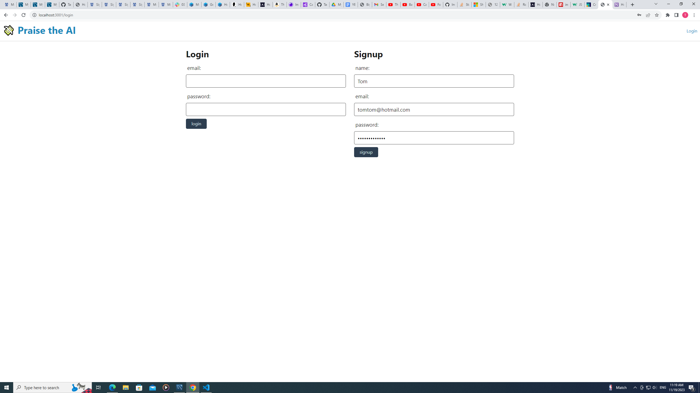
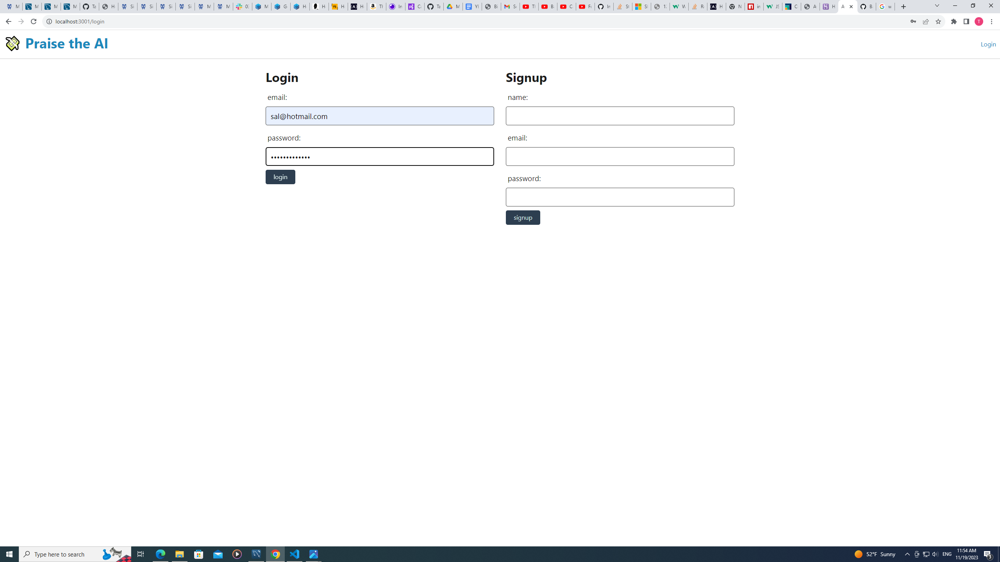
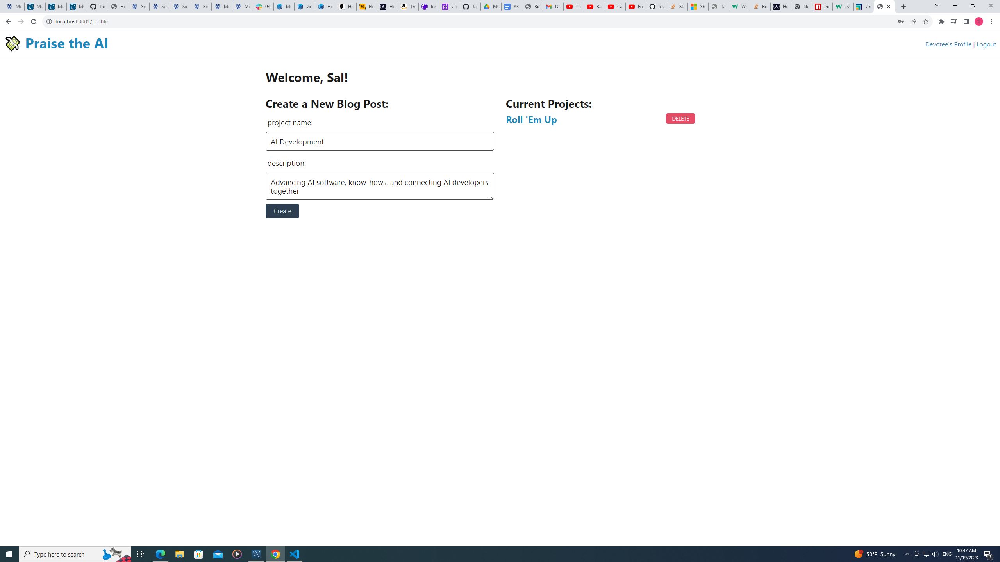
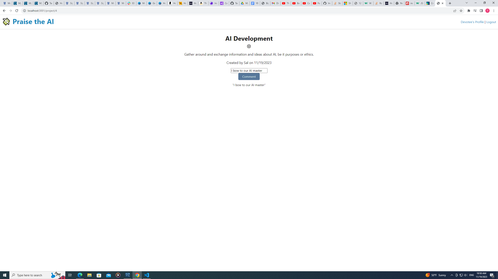

# Tech Blog

With the power of Node.js, Express.js, Sequelize, Handlebars.js, and MVC architecture, this tech blog allows people to read and comment on various topics regarding technology.

## Description (About Praise the AI)

  Praise the AI is a tech blog where unique individuals of all backgrounds can gather and discuss
  Artificial Intelligence, by selectin a blog and making comments.

### How to use

* First, sign up for an account. . 
  After filling in the information, press 'signup'.

* Log into the account you made. .

* Once logged in, it will take you to your profile page. You can either make a new blog
  filling in a name and description, then pressing create. .
  You can also visit the blogs you created by left clicking one under "Current Blogs".

* You can make comments on the blogs by filling the textbox and pressing 'Comment'. . 

#### Deployed Links

  https://praisetheai-b42f04c9927b.herokuapp.com heroku link.

  https://github.com/TaeChung/holytoaster github lnik.

##### Credits

  TA Charlie Puente,
  TA Jaytee Padilla,
  TA Andres Jimenez,
  TA Andrew Tirpok,
  Code from Module 14 mini-project.
